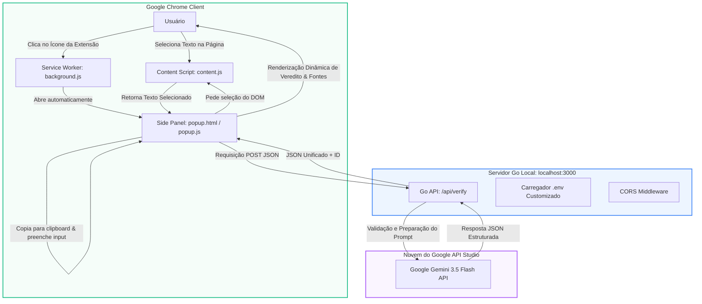

# Serah? 🤖 — Combate à Desinformação em Tempo Real

<p align="center">
  
</p>

<p align="center">
  <strong>Extensão do Chrome premium e integrada ao navegador para análise instantânea de fatos e combate à desinformação apoiada por Inteligência Artificial (Google Gemini 3.5 Flash).</strong>
</p>

<p align="center">
  <a href="#-o-problema">O Problema</a> •
  <a href="#-a-solução">A Solução</a> •
  <a href="#-arquitetura-do-sistema">Arquitetura</a> •
  <a href="#-stack-tecnológica">Tecnologias</a> •
  <a href="#-detalhes-de-implementação">Implementação</a> •
  <a href="#-guia-de-configuração">Instalação & Uso</a> •
  <a href="#%EF%B8%8F-matriz-de-tratamento-de-erros">Erros</a>
</p>

---

> [!IMPORTANT]
> **AVISO DE SEGURANÇA E ADAPTAÇÃO:** Este repositório é uma versão pública adaptada para fins exclusivamente de portfólio e demonstração técnica. Toda informação sensível (como chaves de API, credenciais e tokens) foi removida ou parametrizada através de variáveis de ambiente.

---

## ⚠️ O Problema

Na era digital, a disseminação de fake news e boatos ocorre de forma exponencial. Verificar a veracidade de uma afirmação ou notícia exige que o usuário:
- 🔀 Saia da página atual abrindo novas abas.
- 🔍 Procure manualmente por agências de checagem.
- ⌨️ Copie e cole textos repetidamente.
- 🧠 Gaste energia cognitiva comparando fontes desordenadas.

Esse alto nível de atrito faz com que as pessoas evitem realizar a checagem, compartilhando informações enganosas de forma impulsiva.

---

## ✨ A Solução

O **Serah?** é uma extensão projetada para Google Chrome (Manifest V3) que se integra como um painel lateral (`sidePanel`). Ele reduz o atrito de verificação a **zero**:

1. **Captura em Um Clique**: Ao selecionar qualquer texto em qualquer página e abrir a extensão, o texto é capturado e enviado automaticamente.
2. **Área de Transferência Inteligente**: Copia o texto selecionado para o Clipboard e preenche o campo de texto automaticamente para futuras interações rápidas.
3. **Análise com Structured Outputs**: Envia a consulta para um backend em Go, que aciona a API do Google Gemini usando esquemas rígidos (JSON Schema) para garantir que a resposta retorne com um formato estruturado (veredito, score, explicação e fontes).
4. **Interface Glassmorphic Premium**: Design responsivo elegante com suporte nativo a temas Claro e Escuro baseados nas configurações do sistema do usuário.

---

## 📐 Arquitetura do Sistema

A extensão divide-se em um Frontend (Client-side) embarcado no navegador e um Backend em Go local que faz o intermédio seguro com as APIs da Google.



---

## 🛠️ Stack Tecnológica

### Frontend (Extensão do Chrome)
- **HTML5 & CSS3**: Interface responsiva construída com CSS puro, utilizando variáveis de cores HSL adaptáveis e estética translúcida (*Glassmorphism*).
- **Vanilla JavaScript (ES6+)**: Sem frameworks ou dependências externas.
- **Chrome Extension APIs**:
  - `chrome.sidePanel`: Usado para fixar a interface no painel lateral do navegador de forma não-intrusiva.
  - `chrome.storage.local`: Utilizado para persistência de sessão e histórico local de verificações de forma segura.
  - `chrome.tabs` / `chrome.runtime`: Comunicação assíncrona baseada em eventos para extrair texto do DOM.

### Backend (Serviço de Intermediação)
- **Go (Golang 1.22+)**: Escrito utilizando estritamente a biblioteca padrão (`net/http`, `encoding/json`, `crypto/rand`).
- **Zero Dependências Externas**: O servidor Go não utiliza frameworks pesados como Gin ou Fiber, mantendo o binário extremamente leve, seguro e rápido de compilar.
- **Unit Testing**: Suite de testes completa com mocks para simulação de comportamento da API Gemini e tratamento de erros do leitor HTTP (`httptest`, `json`).

---

## 💡 Detalhes de Implementação

### 1. Chamada Estruturada (Structured Outputs) com Gemini API
Para evitar a variação caótica de saídas em linguagem natural dos LLMs tradicionais, o backend em Go força a API do Gemini a responder seguindo um esquema rígido de JSON Schema. Veja o trecho de configuração do schema no backend:

```go
"generationConfig": map[string]interface{}{
    "responseMimeType": "application/json",
    "responseSchema": map[string]interface{}{
        "type": "OBJECT",
        "properties": map[string]interface{}{
            "reliability_score": map[string]interface{}{
                "type":        "NUMBER",
                "description": "Nível de confiança decimal de 0.00 a 1.00 sobre a veracidade do texto.",
            },
            "verdict": map[string]interface{}{
                "type":        "STRING",
                "enum":        []string{"verdade", "falso", "duvidoso"},
            },
            "explanation": map[string]interface{}{
                "type":        "STRING",
                "description": "Explicação detalhada e didática em português brasileiro.",
            },
            "sources": map[string]interface{}{
                "type":        "ARRAY",
                "items": map[string]interface{}{
                    "type": "OBJECT",
                    "properties": map[string]interface{}{
                        "title":      map[string]interface{}{"type": "STRING"},
                        "url":        map[string]interface{}{"type": "STRING"},
                        "similarity": map[string]interface{}{"type": "NUMBER"},
                    },
                    "required": []string{"title", "url", "similarity"},
                },
            },
        },
        "required": []string{"reliability_score", "verdict", "explanation", "sources"},
    },
}
```

### 2. Ciclo de Vida da Captura
1. Ao carregar o Side Panel (`popup.js`), ele executa uma consulta rápida e silenciosa à aba ativa.
2. O script de conteúdo (`content.js`) responde com a seleção de texto atual obtida por `window.getSelection()`.
3. Caso haja texto selecionado, o script copia o conteúdo para a área de transferência do usuário usando `navigator.clipboard.writeText`, preenche o formulário e executa automaticamente a requisição para o backend para economizar cliques.

---

## ⚙️ Guia de Configuração

### Requisitos Mínimos
- Google Chrome (ou outro navegador baseado em Chromium) v88+.
- Go (Golang) v1.22 ou superior instalado.
- Chave de API do Gemini obtida em [Google AI Studio](https://aistudio.google.com/).

### Passo 1: Configuração do Backend
1. Clone o repositório em sua máquina local:
   ```bash
   git clone https://github.com/BrThiagoN/serah-googleExtension.git
   cd serah-googleExtension
   ```
2. Crie um arquivo `.env` dentro da pasta `backend/` seguindo o modelo `.env.example`:
   ```bash
   PORT=3000
   GEMINI_API_KEY="SUA_CHAVE_DE_API_DO_GEMINI_AQUI"
   ```
3. Navegue até o diretório do backend e execute o servidor:
   ```bash
   cd backend
   go run main.go
   ```
   > [!TIP]
   > O backend possui um sistema de logs coloridos e elegantes no terminal. Quando iniciar com sucesso, você visualizará a mensagem: `[SUCCESS] GEMINI_API_KEY is set. Backend will use Google Gemini API.` na porta 3000.

### Passo 2: Instalação da Extensão no Navegador
1. Abra o navegador e navegue até a URL `chrome://extensions/`.
2. No canto superior direito, ative a chave **Modo do desenvolvedor**.
3. Clique no botão **Carregar sem compactação** (Load unpacked) no canto superior esquerdo.
4. Selecione a **pasta raiz** do projeto (`serah-googleExtension/`), onde se encontra o arquivo `manifest.json`.
5. Pronto! O ícone do **Serah?** aparecerá na sua barra de extensões. Clique nele para abrir o painel lateral.

---

## 🔌 API do Backend (Referência de Rotas)

### `GET /` — Validação de Status (Health Check)
Verifica se o backend local está operacional.
- **Resposta (200 OK):**
  ```json
  {
    "status": "online",
    "message": "Serah? Backend is running! Go version active."
  }
  ```

### `POST /api/verify` — Checagem de Veracidade
Analisa o texto submetido com a inteligência do Gemini.
- **Headers:** `Content-Type: application/json`
- **Corpo do Request:**
  ```json
  {
    "text": "Texto ou notícia a ser avaliada pela IA"
  }
  ```
- **Resposta (200 OK):**
  ```json
  {
    "id": "7a3bdf01-09de-4b02-a1f9-906cbdf8e851",
    "text": "Texto ou notícia a ser avaliada pela IA",
    "status": "success",
    "analysis": {
      "reliability_score": 0.95,
      "verdict": "verdade",
      "explanation": "Explicação fundamentada em dados...",
      "sources": [
        {
          "title": "Tribunal Superior Eleitoral",
          "url": "https://www.tse.jus.br",
          "similarity": 0.98
        }
      ]
    },
    "timestamp": "2026-07-01T22:50:00Z"
  }
  ```

---

## ⚠️ Matriz de Tratamento de Erros

A extensão implementa um sistema robusto de banners de erros com códigos amigáveis para diagnóstico de falhas técnicas e de permissões.

| Código de Erro | Tipo de Falha | Descrição | Tratamento/Solução |
|:---:|---|---|---|
| **`VAL_400`** | Entrada inválida | O texto enviado para verificação estava em branco ou continha apenas espaços. | O frontend avisa ao usuário para digitar ou selecionar um texto válido. |
| **`VAL_405`** | Erro de protocolo HTTP | Foi feita uma requisição que não utilizou o método HTTP `POST`. | A API retorna status `405 Method Not Allowed`. |
| **`CAP_204`** | Sem seleção | O usuário clicou para capturar texto da página, mas não havia nada selecionado. | Alerta na interface orientando o usuário a grifar o texto. |
| **`CAP_403`** | Permissão negada | Tentativa de captura em páginas restritas do navegador (como `chrome://settings/`). | O frontend trata graciosamente informando que a captura não é permitida ali. |
| **`CAP_404`** | Sem aba ativa | O navegador não conseguiu identificar nenhuma aba ativa ou janela em foco. | Exibe uma mensagem solicitando que o usuário selecione uma aba válida. |
| **`CAP_501`** | Script não injetado | A página foi carregada antes da extensão ser ativada ou não possui scripts injetados. | Recomenda ao usuário recarregar a aba atual (`F5`) para re-injetar o `content.js`. |
| **`STG_501` / `502`** | Armazenamento local | Falha de gravação ou leitura no `chrome.storage.local`. | O sistema usa fallback automático para `localStorage` do navegador. |
| **`AI_503`** | Sem conexão local | O frontend não conseguiu estabelecer comunicação com `http://localhost:3000`. | Notifica o usuário de que o servidor Go local na porta 3000 não está rodando. |
| **`API_KEY_MISSING`** | Chave ausente | O servidor Go local está online, mas a variável `GEMINI_API_KEY` está vazia. | Retorna erro 500 informando que a chave de API precisa ser configurada no `.env`. |
| **`API_CALL_FAILED`** | Falha de serviço externo | O Google Gemini retornou um erro HTTP ou tempo limite expirou (timeout). | A API do backend reporta o erro HTTP e o frontend exibe o aviso no banner. |
| **`SYS_500`** | Erro inesperado | Falhas gerais de parsing de JSON ou problemas desconhecidos de sistema. | Exibe um alerta genérico solicitando nova tentativa. |

---

## 🤝 Integrantes (Equipe ByteBoys)

Desenvolvido originalmente durante a atividade de Hackathon do grupo:

- **Luiz Alberto** — [LinkedIn](https://www.linkedin.com/in/luiz-holanda-030bb0282/)
- **Victor Ribeiro** — [LinkedIn](https://www.linkedin.com/in/dev-victor-ribeiro-baradel/)
- **Rafael Tarug** — [LinkedIn](https://www.linkedin.com/in/tarug/)
- **Thiago Gomes Nascimento** — [LinkedIn](https://www.linkedin.com/in/thiagonascimento08/)

---

## 📜 Licença

Este repositório é de uso aberto para fins educativos, acadêmicos e desenvolvimento de portfólio. Sinta-se livre para explorar o código da extensão e do backend em Go!
