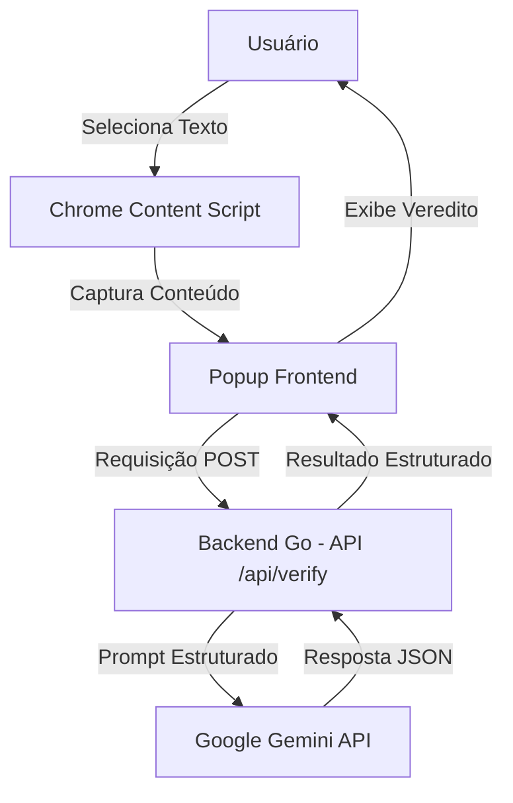

# Serah? 🤖 (PROJETO EXCLUSIVAMENTE DEMONSTRATIVO)

<p align="center">
  
</p>

<p align="center">
  <strong>AVISO IMPORTANTE: Este repositório tem fins exclusivamente demonstrativos. O código não se destina a uso em produção. Todas as informações sensíveis (chaves de API, segredos, credenciais) foram removidas ou ofuscadas.</strong>
</p>

<p align="center">
  <strong>Extensão do Chrome para combater desinformação em tempo real, diretamente na página que você está navegando.</strong>
</p>

<p align="center">
  <a href="#-o-problema">O Problema</a> •
  <a href="#-a-solução">A Solução</a> •
  <a href="#-por-que-uma-extensão-e-não-um-site">Por que uma extensão?</a> •
  <a href="#-funcionalidades">Funcionalidades</a> •
  <a href="#-instruções-de-uso">Como usar</a>
</p>

---

## ⚠️ O Problema

Vivemos em uma era onde:
- 🔍 A desinformação se espalha mais rápido do que nunca
- ⏳ Validar uma informação exige abrir várias abas e perder tempo
- 🐦 O compartilhamento impulsivo de notícias falsas é comum
- 📚 Pesquisar fontes confiáveis requer esforço cognitivo considerável

Esse atrito faz com que muitas pessoas desistam de verificar o que leem, contribuindo para a proliferação de fake news e conteúdos enganosos.

---

## ✨ A Solução

O **Serah?** é uma extensão para Chrome que integra diretamente ao navegador, permitindo que você:
- ✅ Verifique a veracidade de um texto com um clique
- ✅ Analise o conteúdo sem sair da página
- ✅ Receba explicações detalhadas e fontes confiáveis
- ✅ Acesse um painel lateral sempre que precisar

---

## 🚀 Por que uma extensão e não um site?

Esta é a principal vantagem do Serah? e o que torna tudo diferente!

| **Site tradicional** | **Extensão Serah?** |
|------------------------|---------------------|
| 🔀 Exige abrir outro site e trocar de aba | ✅ Não abandona a página que você está lendo |
| ⏳ Demora para carregar, digitar, colar | ⚡ Funciona instantaneamente com o texto selecionado |
| 💭 Perde o contexto do conteúdo original | 🎯 Mantém o contexto completo da sua navegação |
| 📝 Requer copiar/colar manualmente | 📥 Captura o texto automaticamente |
| 😓 Atrito elevado desincentiva o hábito | 🤩 Simples, rápido, incentiva verificações frequentes |
| 🔼 Maior chance de compartilhar algo falso | 🔽 Reduz drasticamente o compartilhamento de desinformação |

Serah? não é só mais um chatbot — é uma **camada de inteligência diretamente no seu navegador**, projetada para fazer da verificação de fatos um hábito natural, sem atritos.

---

## 🛠️ Funcionalidades

* **Captura de Texto Seleciona:** Grife qualquer texto na página e clique para capturar automaticamente
* **Sidepanel Moderno:** Interface premium com glassmorphism, suporte a tema claro/escuro
* **Histórico Local:** Armazena suas últimas verificações no chrome.storage
* **IA Potente:** Utiliza Google Gemini 1.5 Flash para análise de veracidade
* **Relatório Detalhado:** Veredito (verdade, falso, duvidoso), score de confiabilidade e fontes recomendadas
* **Zero Dependências Backend:** Servidor Go usando apenas a biblioteca padrão

---

## 📐 Arquitetura



### Componentes Principais

| Camada | Arquivo | Responsabilidade |
|--------|---------|-----------------|
| **Frontend Popup** | `popup.html` / `popup.css` / `popup.js` | Interface do usuário no painel lateral |
| **Content Script** | `content.js` | Injetado em todas as páginas para capturar texto selecionado |
| **Background Service Worker** | `background.js` | Gerencia eventos da extensão em segundo plano |
| **Backend API** | `backend/main.go` | Servidor Go que intermedia a comunicação com a IA |

---

## 🔄 Fluxo de Funcionamento

1. 🔤 Usuário seleciona um texto na página da web que deseja verificar
2. 🔍 Usuário abre o painel lateral do Serah? (clicando no ícone da extensão)
3. ⬇️ O `popup.js` captura o texto selecionado via `content.js` (ou o usuário pode digitar manualmente)
4. 📤 Quando o usuário clica em "Enviar", o popup faz uma requisição `POST http://localhost:3000/api/verify`
5. 🧠 O servidor Go (`main.go`) recebe o texto, prepara um prompt estruturado e chama a API do Google Gemini
6. 📊 Gemini retorna o veredito, score de confiabilidade, explicação e fontes
7. 📃 O popup exibe o relatório completo para o usuário no painel lateral

---

## 📁 Estrutura do Projeto

```
byteboys_serah/
├── backend/
│   ├── .env             # Arquivo de variáveis de ambiente local (não versionado)
│   ├── .env.example     # Exemplo de variáveis de ambiente para o backend
│   ├── coverage.out     # Relatório de cobertura de testes
│   ├── go.mod           # Módulo Go
│   ├── main.go          # Código do servidor Go
│   └── main_test.go     # Testes do backend
├── images/
│   ├── icon128.png      # Ícone da extensão (128x128)
│   ├── icon16.png       # Ícone da extensão (16x16)
│   ├── icon32.png       # Ícone da extensão (32x32)
│   └── icon48.png       # Ícone da extensão (48x48)
├── styles/
│   └── color-palette.css # Sistema de cores oficial
├── background.js        # Service Worker da extensão
├── content.js           # Script injetado nas páginas
├── manifest.json        # Manifesto da extensão Chrome (v3)
├── popup.css            # Estilos do frontend
├── popup.html           # Layout do painel lateral
└── popup.js             # Lógica da interface
```

---

## 🎨 Sistema de Design

### Paleta Oficial

#### Verdes (Primárias / Ação)
| Cor | Hex | Uso |
|-----|-----|-----|
| Verde Escuro | `#0E8A4B` | Botões primários, links de confirmação |
| Verde Médio | `#19B86A` | Hover de botões, destaque |
| Verde Alternativo | `#14B866` | Estados de sucesso |
| Verde Claro | `#23D17B` | Indicadores de status ativo |

#### Vermelhos (Alerta / Erro)
| Cor | Hex | Uso |
|-----|-----|-----|
| Vermelho Escuro | `#D62828` | Erros críticos |
| Vermelho Escuro Alternativo | `#B71C1C` | Mensagens de erro |
| Vermelho Claro | `#FF5252` | Alertas de aviso |
| Vermelho Muito Claro | `#FF6B6B` | Elementos decorativos de erro |

#### Neutros (Estrutura)
| Cor | Hex | Uso |
|-----|-----|-----|
| Preto Profundo | `#121212` | Fundo do tema escuro |
| Preto Médio | `#1B1B1B` | Fundo de cards no tema escuro |
| Preto Claro | `#252525` | Bordas no tema escuro |
| Branco Neve | `#F8FAF9` | Fundo do tema claro |
| Branco Puro | `#FFFFFF` | Fundo de cards no tema claro |

#### Textos
| Cor | Hex | Uso |
|-----|-----|-----|
| `#1A1A1A` | Texto principal (tema claro) |
| `#5E646A` | Texto secundário (tema claro) |
| `#B0B8BE` | Texto secundário (tema escuro) |
| `#F5F5F5` | Texto principal (tema escuro) |

---

## ⚙️ Instalação

### Requisitos

* **Chrome/Edge/Brave (ou outro navegador baseado em Chromium)**: Versão 88 ou superior
* **Go (para o backend)**: 1.22 ou superior (se quiser rodar o servidor localmente)
* **Chave API do Google Gemini**: Obtida gratuitamente no [Google AI Studio](https://aistudio.google.com/)

---

## 🚀 Executando o Backend (Apenas para demonstração local)

1.  Clone o repositório:
    ```bash
    git clone https://github.com/SEU_USUARIO/NOME_DO_REPOSITORIO.git
    cd NOME_DO_REPOSITORIO
    ```

2.  Entre na pasta do backend:
    ```bash
    cd backend
    ```

3.  Configure sua chave da API (não inclusa):

    **Linux/macOS:**
    ```bash
    export GEMINI_API_KEY="SUA_CHAVE_AQUI"
    go run main.go
    ```

    **Windows (PowerShell):**
    ```powershell
    $env:GEMINI_API_KEY="SUA_CHAVE_AQUI"
    go run main.go
    ```

    **Windows (Command Prompt):**
    ```cmd
    set GEMINI_API_KEY=SUA_CHAVE_AQUI
    go run main.go
    ```

4.  Você verá uma mensagem confirmando que o servidor está rodando na porta 3000!

---

## 📦 Carregando a Extensão no Chrome

1.  Abra o Chrome e navegue para `chrome://extensions/`
2.  Ative o **Modo do Desenvolvedor** (canto superior direito)
3.  Clique em **Carregar sem compactação**
4.  Selecione a **pasta raiz** do projeto (`byteboys_serah/`, não a `backend/`!)
5.  A extensão aparecerá na lista e no seu menu de extensões!

---

## 🔌 API do Backend

### `GET /` - Health Check
Verifica se o servidor está no ar.
*   **Resposta 200 OK:**
    ```json
    {"status":"online","message":"Serah? Backend is running! Go version active."}
    ```

### `POST /api/verify` - Verificação de Veracidade
*   **Cabeçalhos:** `Content-Type: application/json`
*   **Corpo da Requisição:**
    ```json
    {"text": "Texto que você quer verificar"}
    ```
*   **Resposta 200 OK:**
    ```json
    {
      "id": "uuid-da-analise",
      "text": "Texto que você quer verificar",
      "status": "success",
      "analysis": {
        "reliability_score": 0.85,
        "verdict": "verdade",
        "explanation": "Explicação detalhada...",
        "sources": [
          {
            "title": "Agência Lupa",
            "url": "https://lupa.uol.com.br/",
            "similarity": 0.95
          }
        ]
      },
      "timestamp": "2026-06-21T12:56:41Z"
    }
    ```

---

## 💡 Casos de Uso

1. **📰 Verificando Notícias:** Leu uma notícia suspeita? Selecione o texto e peça para o Serah? analisar
2. **📱 Postagens em Redes Sociais:** Qualquer compartilhamento parece exagerado? Verifique em segundos!
3. **💬 Mensagens em Grupos:** Recebeu uma afirmação radical no WhatsApp ou Telegram? Confira sua veracidade
4. **📊 Estatísticas e Dados:** Dados sobre saúde, política ou economia parecem incorretos? Valide-os
5. **🗣️ Afirmações Políticas:** Não se deixe enganar por discursos sem base — use a IA para verificar

---

## 🚀 Melhorias Futuras

* 📚 Histórico sincronizado na nuvem
* 📊 Dashboard com estatísticas das verificações do usuário
* 🔗 Integração com mais APIs de fact-checking (como Lupa, Aos Fatos, Fato ou Fake)
* 📱 Versão para Firefox
* 🌐 Suporte a múltiplos idiomas
* ⚙️ Página de configurações da extensão

---

## 🤝 Equipe ByteBoys

<div align="center">

| Integrante | LinkedIn |
|------------|----------|
| 👨‍💻 **Luiz Alberto** | [](https://www.linkedin.com/in/luiz-holanda-030bb0282/) |
| 👨‍💻 **Victor Ribeiro** | [](https://www.linkedin.com/in/dev-victor-ribeiro-baradel/) |
| 👨‍💻 **Rafael Tarug** | [](https://www.linkedin.com/in/tarug/) |
| 👨‍💻 **Thiago Nascimento** | [](https://www.linkedin.com/in/thiagonascimento08/) |

</div>

---

## 📜 Licença

Este repositório é aberto para aprendizado e desenvolvimento!
